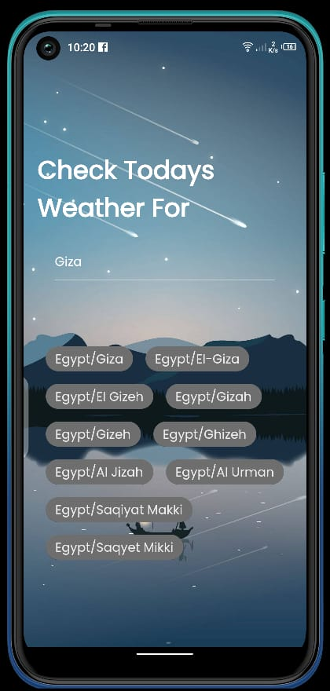
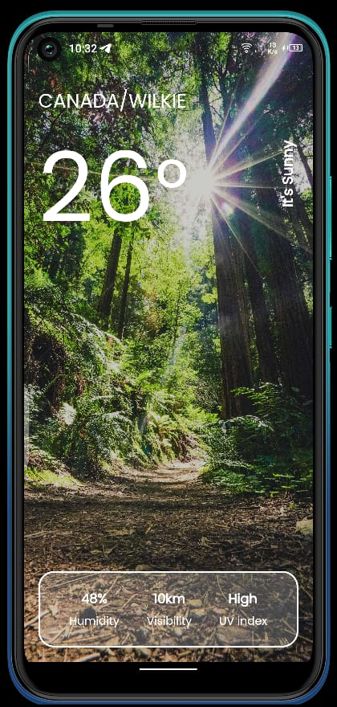
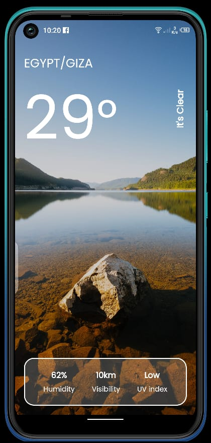
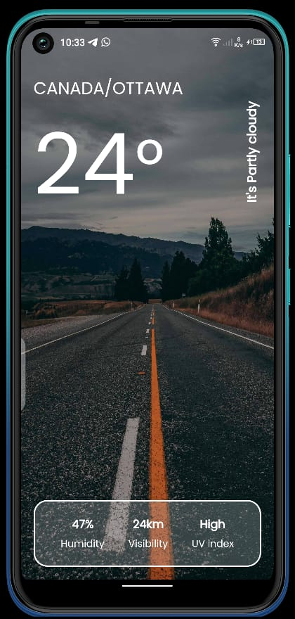

# weather_app

A weather app created using Flutter framework.

## About

The app contains 2 screens

1. Search screen: to search for country or city to fetch its weather data
2. Weather screen: the screen where weather data is presented

- The weather screen shows a background depending on the weather state [sunny, clear, raining, snow, cloudy, windy]

## Used packages

- Used Bloc for state management
- Used freezed and dartz for clean code
- used flutter_dotenv to load environment variables and secrets
- used get_it and injectable for dependency injection
- used dio, retrofit and json_serializable for api fetching

### Resources

- weatherapi.com is used to fetch weather data
- unsplash and pexels are used for free backgrounds
- flaticon is used for app icon

## Screenshots

- Search screen with Giza as query

- Weather screen with Canada/Wilkie as title and a sunny weather background

- Weather screen with Egypt/Giza as title and a clear weather background

- Weather screen with Canada/Ottawa as title and a cloudy background
